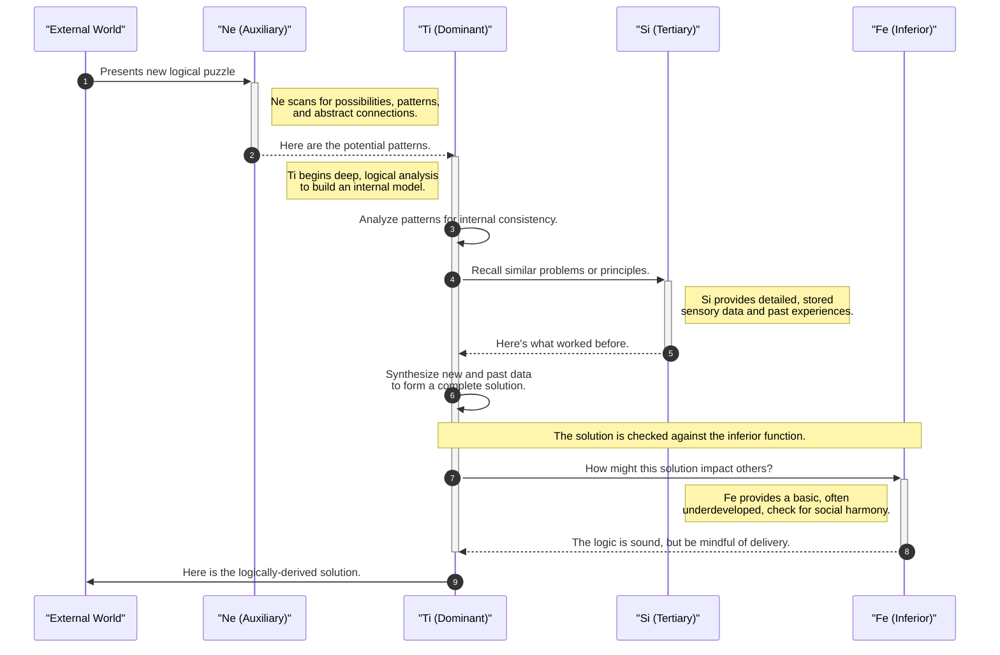

# Jungian Cognitive Functions as an Information Processing System

This document contains a sequence diagram that models the Jungian cognitive functions of an INTP personality type as they process information to solve a logical puzzle.

## Sequence Diagram (Mermaid.js)

You can view this diagram by pasting the code block below into a Mermaid.js-compatible renderer, such as the one provided by GitHub, GitLab, or online editors like [mermaid.live](https://mermaid.live).

